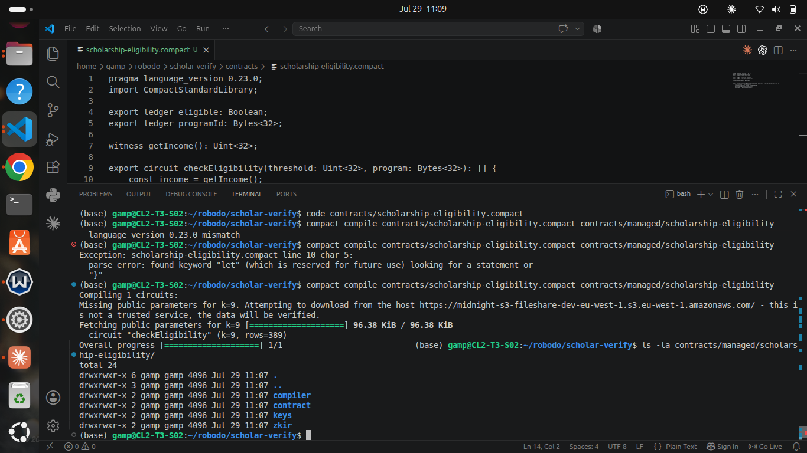
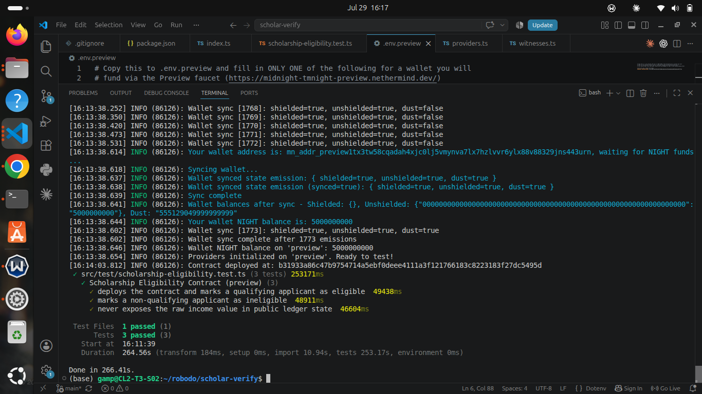

# ScholarVerify

> Prove scholarship eligibility without revealing your income — zero-knowledge threshold verification on Midnight.

## Live Demo

https://scholar-verify.vercel.app

## Contract Address

| Network | Address |
|---------|---------|
| Preprod | `3182851944c8320e06fda1551cf5d9de0e4f2dd3e462bdf215207d5f216dd486` |
| Preview | `b31933a86c47b9754714a5ebf0deee4111a3f121766183c8223183f27dc5495d` |

## What This Does

ScholarVerify is a privacy-preserving eligibility checker built on Midnight. An applicant's income never leaves their own machine — instead, a zero-knowledge circuit proves whether their income meets a scholarship program's threshold, and only that yes/no result is written to the public ledger.

This solves a real problem: scholarship and grant programs typically require applicants to disclose sensitive financial data to prove eligibility, creating privacy risk and discouraging honest applications. ScholarVerify lets a program verify eligibility with mathematical certainty, without ever seeing the applicant's actual income.

The frontend connects directly to a Midnight wallet (1AM), lets an applicant enter their income locally in the browser, generates a zero-knowledge proof, and submits only the eligibility result on-chain.

## Privacy Model

- **PUBLIC** (on-chain, visible to anyone): whether the applicant is `eligible` (true/false), and the `programId` they applied under.
- **PRIVATE** (private witness, never on-chain): the applicant's actual income figure.
- **What the user PROVES without revealing:** that their income is less than or equal to the program's threshold — without ever disclosing the specific number.

## Privacy Claim

An on-chain observer watching this contract can see that a `checkEligibility` call occurred, the `programId` involved, and the resulting `eligible` boolean (true or false). They cannot see the applicant's actual income figure, cannot infer how close the applicant was to the threshold, and cannot reconstruct the private computation — only that a valid zero-knowledge proof confirmed the threshold comparison was performed correctly. This can be independently verified on the [public block explorer](https://explorer.1am.xyz/) for any transaction against this contract.

## Vision and Roadmap

ScholarVerify's Level 1/2 submission delivers the core privacy primitive: income-threshold eligibility verification with zero data exposure. The long-term vision extends this same model further:

- **Phase 1 (current):** Income-based scholarship eligibility — an applicant proves their income is below a program's threshold without revealing the figure.
- **Phase 2 (planned):** Extend the same disclose-only-the-result pattern to academic credentials and course completion, letting institutions verify what someone has achieved (a degree, a certification, a passing grade) without exposing full transcripts or records.
- **Phase 3 (planned):** Support multiple eligibility criteria per program (income *and* academic standing *and* prior grant history), combined into a single proof, so applicants prove they meet a program's full requirements in one interaction.

## Tech Stack

- Midnight network, Compact language, Midnight.js SDK, DApp Connector API, React, Vite, TypeScript, 1AM wallet, Node.js v22, Docker, Yarn, Vitest

## Prerequisites

- [1AM wallet](https://chromewebstore.google.com/detail/1am/bphnkdkcnfhompoegfpgnkidcjfbojjp) browser extension installed, configured for Midnight → Preprod
- Node.js v22 (use `nvm install 22 && nvm use 22`)
- Docker + Docker Compose
- Yarn (via Corepack: `corepack enable && corepack prepare yarn@1.22.22 --activate`)
- Compact compiler ([install instructions](https://docs.midnight.network/getting-started/installation))

## Setup

```bash
git clone https://github.com/Sus-Nexus07/scholar-verify.git
cd scholar-verify
nvm use
yarn install
compact compile contracts/scholarship-eligibility.compact contracts/managed/scholarship-eligibility
```

## Run Locally (Frontend)

```bash
yarn dev
```

Open `http://localhost:5173`, connect your 1AM wallet (set to Preprod), and use the app to deploy or call the contract. Proving happens via 1AM's own proving service (ProofStation) — no local Docker proof server is required for the frontend.

## Level 1 (Contract Deployment)

Level 1 — the Compact contract, toolchain, and initial deployment — is complete and was reviewed/approved separately. The contract source is at `contracts/scholarship-eligibility.compact`, with a Node.js CLI test harness for local and remote deployment testing.

Run Tests (Node CLI, Level 1 harness):

Local devnet:
```bash
yarn env:up
yarn test:local
yarn env:down
```

Preview network (requires a funded wallet — see `.env.preview.example`):
```bash
yarn proof:up
yarn test:preview
yarn proof:down
```

## Demo Video

Watch the demo: https://youtu.be/UE-owV1pwLY

The video shows the full flow: connecting a Midnight wallet on Preprod, entering an income figure, generating a zero-knowledge proof locally, and verifying the on-chain eligibility result — all without the income ever being exposed.

## Initial Idea

*Scholarship and grant programs require applicants to prove they meet eligibility criteria such as income thresholds, academic performance, or prior grant history. Today, that means exposing sensitive financial and academic data to reviewers who may mishandle or leak it, and it discourages honest applicants who don't want their real numbers on record. ScholarVerify solves this with a zero-knowledge circuit: applicants prove they meet a program's threshold without revealing the underlying figure, so reviewers get a verifiable yes/no answer instead of raw personal data. Starting with income-based scholarship eligibility, the long-term vision extends this same privacy-preserving verification model to academic credentials and course completion — letting institutions confirm what someone has achieved without exposing their full record.*

## Screenshots

**Successful compile output:**


**Contract deployed on Preview (Level 1):**
